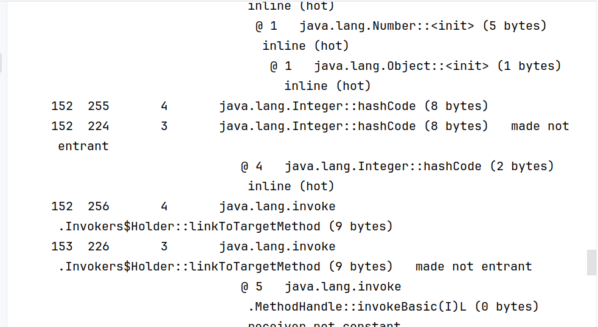
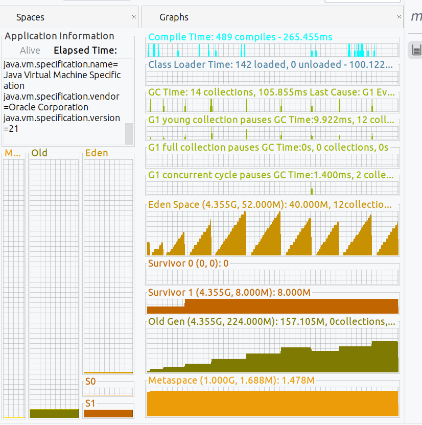
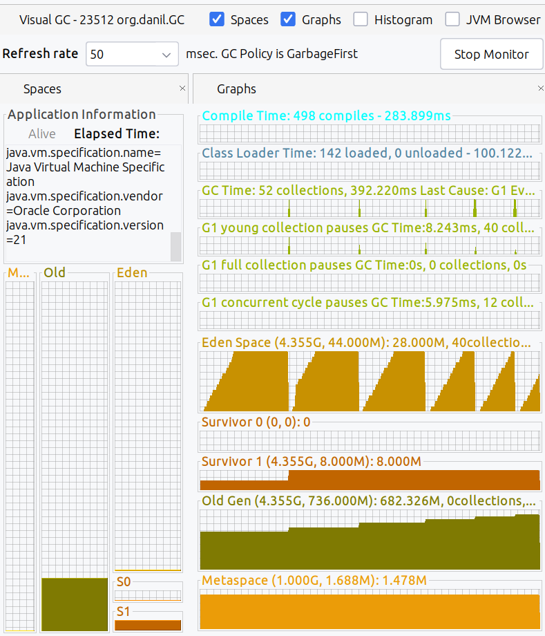

# Домашнее задание №15
## По JIT:
Сделать цикл на 100000 итераций, в цикле в предварительно созданную Map<Integer, String> сложить ключ - индекс, значение - "value" + индекс
- Запустить с опцией -XX:+PrintCompilation, проанализировать информацию в консоли
- Запустить с опцией -XX:+PrintCompilation -XX:+UnlockDiagnosticVMOptions -XX:+PrintInlining , проанализировать информацию в консоли
### Результаты

## По GC:
Из %JAVA_HOME%\bin запустить jvisualvm, установить через пункт меню Tools\Plugins\Available Plugis плагин: Visual GC
  
Запустить приложение создающее много объектов с разными GC, посмотреть в jvisualvm как заполняются объекты в разных областях памяти(heap)
### Результаты

