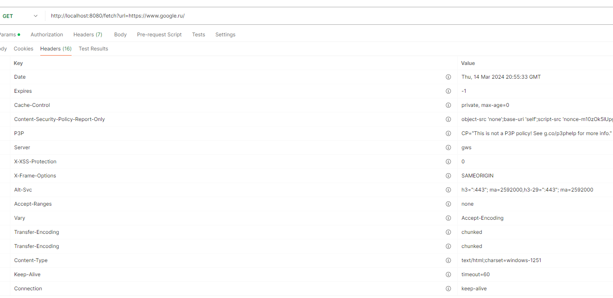
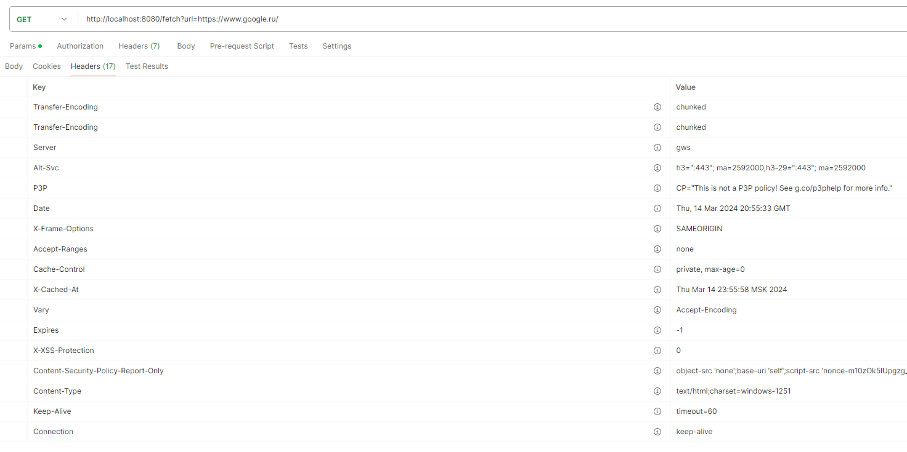
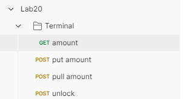

# Домашнее задание №20

1. Написать WEB-приложение c сервлетом|сервлетным фильтром, который осуществляет получение содержимого удалённого ресурса и возвращает его в своём ответе (GET запрос).
     Ссылка на ресурс передаётся в параметре url исходного запроса.
     Сервлет должен кэшировать результаты успешных запросов (код ответа 2??), и в случае повторного запроса возвращать сохранённый результат.
     В ответе должен быть дополнительный заголовок с информацией о дате занесения его в кэш (дате фактического получения ответа с удалённого сервера).
     Используйте WeakHashMap в качестве структуры кэша, где URL ключ, а значение - код ответа + заголовки + содержимое.
2. Реализуйте REST сервис работы с терминальным сервером из домашнего задания занятия про Exceptions. Используйте Spring Web MVC. Верно выбирайте типы запросов и коды состояний HTTP. 
### Результаты
#### Задание 1

Первый запрос на https://www.google.ru/

Последующий запрос на https://www.google.ru/

Появился заголовок `X-Cached-At: Thu Mar 14 23:55:58 MSK 2024`

> Не совсем понимаю, зачем здесь применять `WeakHashMap`. Сильная ссылка на ключ потеряется сразу после окончания запроса, gc в скором времени удалит значение. Кеш оказывается живым ровно до сборки мусора. Может тут лучше LRU кеш на `LinkedHashMap`?

#### Задание 2
Перенес терминал из старой домашки, как он и был. На исключения навесил `@ResponseStatus` с подходящими http кодами ошибок. Добавил эндпоинты в Postman и протестил.

> `TerminalServerLockImpl` - реализация варианта защиты терминала `TerminalServerImpl`. Решил поместить эту сущность в пакет component. 