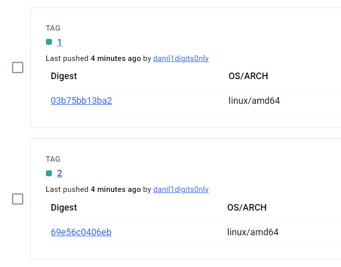

# Домашнее задание №21

1.	Зарегистрироваться в google cloud(или любой другой облачной платформе) и создать проект с istio
      или установить minikube на локальную машину и установить туда istio.
      Первый вариант предпочтительней.
2.	Написать hello world spring boot приложение, возвращающая на GET запрос текущую дату.
3.	Составить docker file для сборки образа c вашим приложением
4.	Собрать образ, проверить локальную работоспособность
5.	Запушить образ в один из публичных registry. Например, dockerhub
6.	Удалить локальный образ, запушить с dockerhub
7.	Развернуть приложение в google cloud с использованием istio

Продвинутое домашнее задание (не обязательно):
1.	Написать фронт приложение, которое будет красиво отображать текущую дату. Текущую дату фронт должен запрашивать у бэкэнда.
2.	Развернуть оба приложения в google cloud с использованием istio
3.	Пробить роут до приложения.
4.	Выполнить несколько запросов, посмотреть как они будут выглядеть в Kiali
5.	Выпустить новую версию фронт приложения с изменением стиля отображения.
6.	Выполнить канареечное развертывание фронта, настроить на использование одного бека.
7.	Проверить, что под единым роутом нам доступны то одна то другая версия приложения.

### Результаты

- Для бэкенда составил двухэтапный [Dockerfile](Dockerfile)
  - Сборка происходит в контейнере с JDK 
  - Сервер запускается в контейнере с JRE
- У фронтенда тоже двухэтапный [Dockerfile](frontend/Dockerfile)
  - Сборка в контейнере node:21-alpine (фронтенд тоже нужно собирать)
  - Раздача статических файлов фронтенда с помощью контейнера с nginx, а также проксирование к бэкенду
- Мелкий docker-compose, чтобы локально потестить
- Запушил образы для [бэкенда](https://hub.docker.com/r/danil1digits0nly/lab21-api) и [фронтенда](https://hub.docker.com/r/danil1digits0nly/lab21-frontend)
- У фронтенда 2 версии, начальная и канарейка 
- Использовал VK Cloud
- ... дальше пока ничего ...