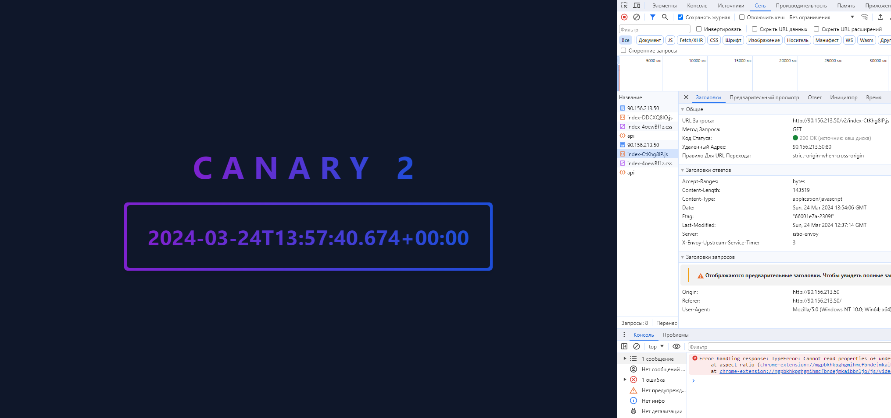

# Домашнее задание №21

1. Зарегистрироваться в google cloud(или любой другой облачной платформе) и создать проект с istio
   или установить minikube на локальную машину и установить туда istio.
   Первый вариант предпочтительней.
2. Написать hello world spring boot приложение, возвращающая на GET запрос текущую дату.
3. Составить docker file для сборки образа c вашим приложением
4. Собрать образ, проверить локальную работоспособность
5. Запушить образ в один из публичных registry. Например, dockerhub
6. Удалить локальный образ, запушить с dockerhub
7. Развернуть приложение в google cloud с использованием istio

Продвинутое домашнее задание (не обязательно):

1. Написать фронт приложение, которое будет красиво отображать текущую дату. Текущую дату фронт должен запрашивать у
   бэкэнда.
2. Развернуть оба приложения в google cloud с использованием istio
3. Пробить роут до приложения.
4. Выполнить несколько запросов, посмотреть как они будут выглядеть в Kiali
5. Выпустить новую версию фронт приложения с изменением стиля отображения.
6. Выполнить канареечное развертывание фронта, настроить на использование одного бека.
7. Проверить, что под единым роутом нам доступны то одна то другая версия приложения.

## Результаты

- Для бэкенда составил двухэтапный [Dockerfile](Dockerfile)
    - Сборка происходит в контейнере с JDK
    - Сервер запускается в контейнере с JRE
- У фронтенда тоже двухэтапный [Dockerfile](frontend/Dockerfile)
    - Сборка в контейнере node:21-alpine (фронтенд тоже нужно собирать)
    - Раздача статических файлов фронтенда с помощью контейнера с nginx, а также проксирование к бэкенду
- Мелкий docker-compose, чтобы локально потестить
- Запушил образы для [бэкенда](https://hub.docker.com/r/danil1digits0nly/lab21-api)
  и [фронтенда](https://hub.docker.com/r/danil1digits0nly/lab21-frontend)
- У фронтенда 2 версии: стабильная и канарейка 
- Использовал VK Cloud 
- Файлы деплоя в папке [deployments](deployments)
- Выпустил [стабильную](deployments/2-deployment-v1.yaml) и [канарейку](deployments/2-deployment-v2.yaml) отдельными деплоями + единственный деплой на общий [бэкенд](deployments/1-deployment-api.yaml)
- Распределил запросы между версиями с помощью [VirtualService](deployments/5-virtual-service.yaml) в пропорциях 30/70

### Столкнулся с проблемой раздачи статических файлов при такой схеме распределения:
- Первым запросом получаем index.html по роуту ```/```
  - V1 возвращает index.html с ```<script src="index-awdj21.js">```
  - V2 возвращает index.html с ```<script src="index-jtu2oa.js">```
  > Имена скриптов отличаются из-за разного содержимого. При изменении исходников, сборщик пересчитывает хеш и добавляет в конец названия файла. Это способствует кешированию.
- Второй запрос запрашивает указанный скрипт
    - Если балансировщик перенаправил запрос на ту же версию сервиса, то все хорошо;
    - но если он перенаправит на другую версию, то файл не будет найден.

### Возможные решения

#### Сделать одинаковыми названия скриптов
Такой файл будет закеширован навсегда, пользователь теперь будет использовать либо stable, либо канарейку.
Или кеширование отключаем/снижаем строгость и немного теряем в производительности.

#### Заинлайнить все зависимости в index.html
Рабочий, но не оптимальный вариант.

#### Матчинг по заголовку X-Version
В html код с таким тегом ```<script src="index-awdj21.js">``` я не могу добавить заголовок X-Version.

#### Матчинг по cookie
Привязывает пользователя на определенный срок к версии приложения. Требует VirtualService добавлять заголовок Set-Cookie. Если заголовок уже выставлен, например api сервером, то нужно мержить заголовки; это требует кода на Lua внутрVirtualService. Этот вариант таки не попробовал.

#### Конечный вариант
1. В [package.json](frontend/package.json#version) указываю версию приложения
2. [Сборщику](frontend/vite.config.js) фронта указываю добавлять префикс к статическим файлам с версией
из [package.json](frontend/package.json#version)
3. Результаты такой сборки
   - статика сервиса v1
     - index.html
     - v1
       - index-DDCXQ8IO.js
       - index-4oewBf1z.css
   - статика сервиса v2
     - index.html
     - v2
       - index-CtKhg8lP.js
       - index-4oewBf1z.css
4. Настраиваю [VirtualService](deployments/5-virtual-service.yaml) для мэтчинга по префиксу урла
   - Первый запрос на / балансируется
   - Второй на /v2/index-CtKhg8lP.js строго определяет сервис
5. В результате индексный файл определяет канареечную выкатку, а после выбора версии все запросы к статике идут куда надо.

#### Бонусный вариант
А можно ли как-то складировать статические файлы разных версий фронта на едином сервере?
Такой сервер отработает запрос на любой файл любой версии фронта.
А балансировка будет все также по index.html 


## Как выглядит результат
[Приложение](http://90.156.213.50/) захостил, но кластер жутко дорогой, а рублей осталось не более чем до 28.03.2024.

На случай отключения хостинга вот скрины результатов. Можно увидеть разное отображение версии и запрос к статике на /v1/index*.js и v2/index*.js

