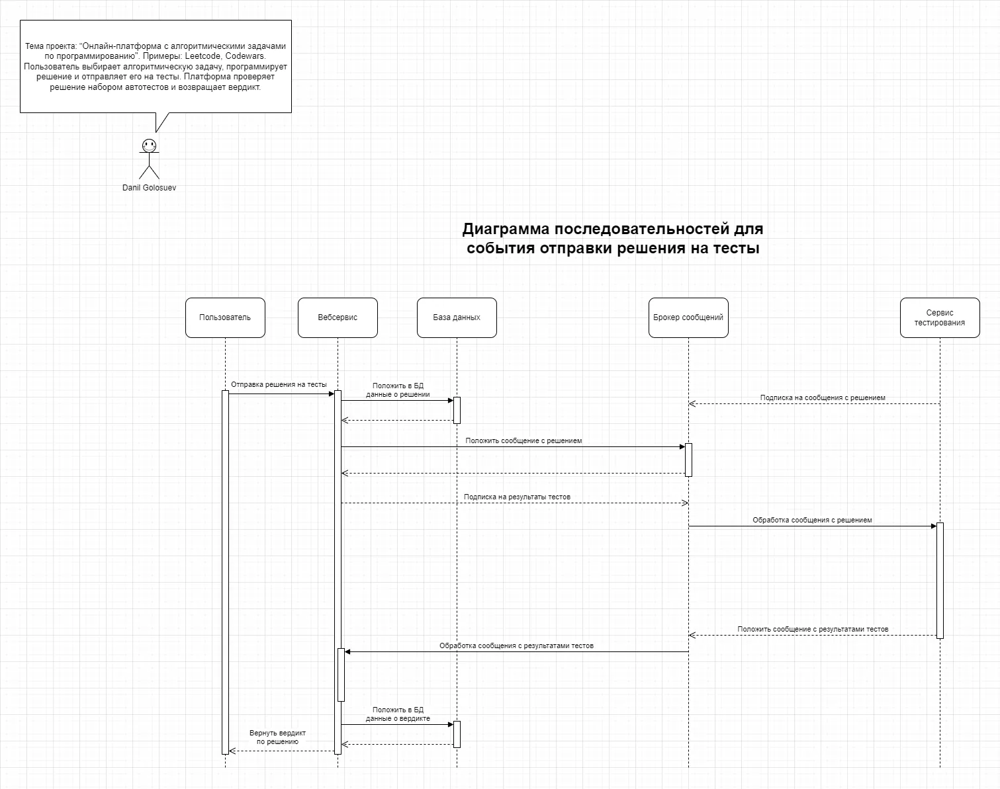

# Домашнее задание №21
## Разработка автотестов

1. Переписать ТЗ выпускного проекта; (Опционально)
2. Нарисовать диаграмму последовательностей.
> (которые иногда также называют диаграммами (или сценариями) событий, показывают, в каком порядке происходит взаимодействие между объектами. С помощью таких диаграмм довольно легко составлять незамысловатые сценарии рабочих циклов)
3. Расписать test cases. (Можно прямо в unit тестах).

## Результаты

ТЗ для выпускного проекта не имею. Тему сам выбрал. 
Писать ТЗ все равно придется (эта же тема для диплома в универ), но я пока не хочу.

[Диаграмма последовательностей](sc-sequence.webp) для основного алгоритма работы ПО.  

Клиент взаимодействует напрямую только с веб-сервисом. 
Веб-сервис связан с БД и взаимодействует с сервисом тестирования через кафку.  
Сервис тестирования с БД не связан, работает только через кафку. 

Все время тестирования клиент ожидает завершения POST запроса к веб-сервису. 
Если это соединение оборвется, то это не помешает веб-сервису положить результат тестирования в БД. 
Далее клиент при следующей загрузке получит актуальное состояние из БД. 

Тестировать всю эту схему и отдельные куски довольно сложно. Пока не спешу с этим, потому что код приложения нестабилен, да и пока что в приоритете написание фич, а не тестов.

Я решил написать тесты на фронтенд на TypeScript. Такое для меня в новинку, но на фронтенде тоже бывает логика, которую можно протестировать.  
Там ничего сложного нет, для чтения тестов на TS достаточно знаний из других языков.    

### Тест хранилища состояния вкладок
Проверка работы хранилища состояния [useTabs.test.ts](https://github.com/kemper0110/supreme-code/blob/master/frontend/tests/useTabs.test.ts)

Исходник [useTabs.tsx](https://github.com/kemper0110/supreme-code/blob/master/frontend/src/store/useTabs.tsx)

### Тест хранилища состояния аутентификации пользователя
Проверка работы хранилища состояния [useUser.test.ts](https://github.com/kemper0110/supreme-code/blob/master/frontend/tests/useUser.test.ts)

Исходник [useUser.tsx](https://github.com/kemper0110/supreme-code/blob/master/frontend/src/store/useUser.tsx)